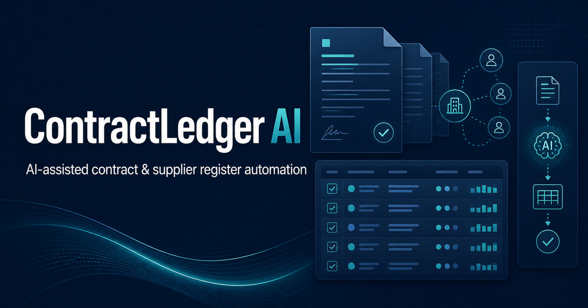
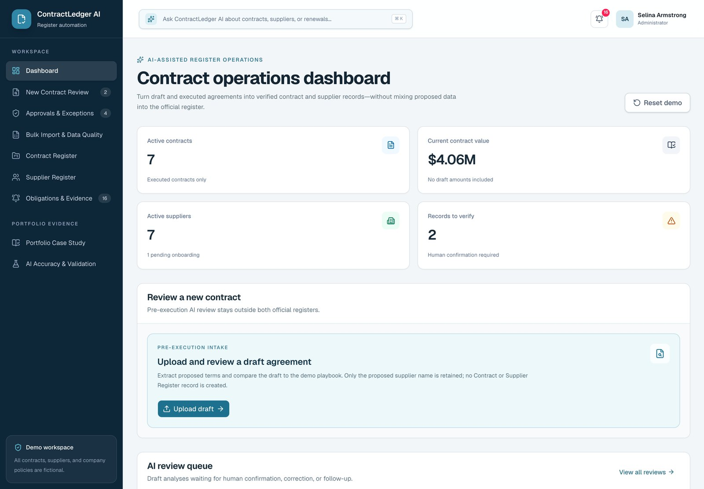
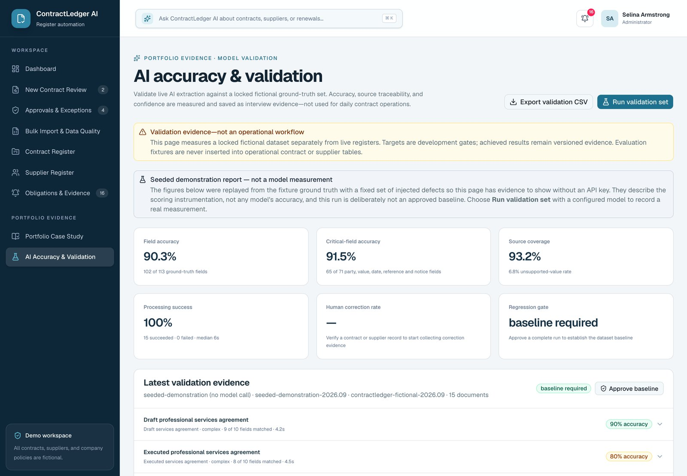
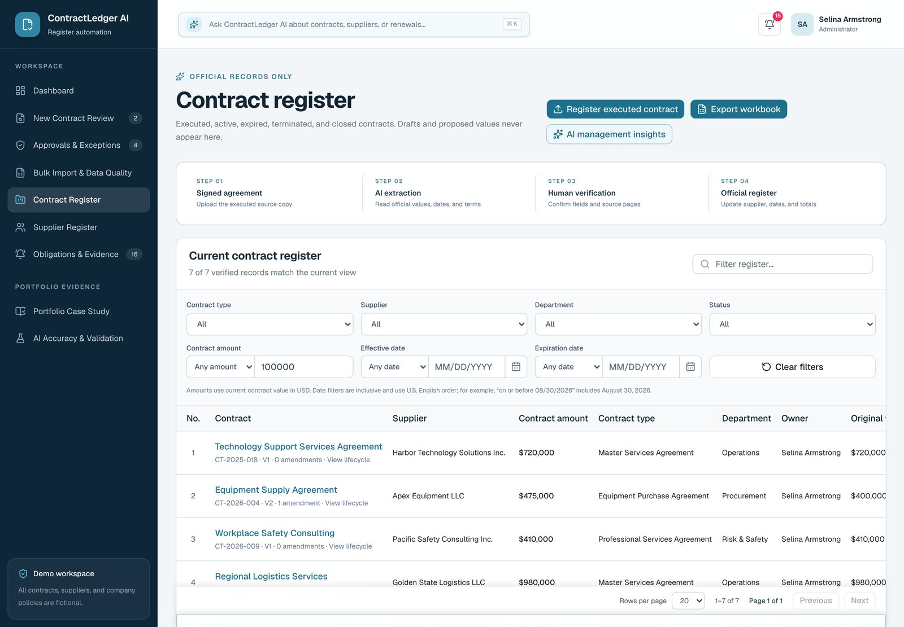
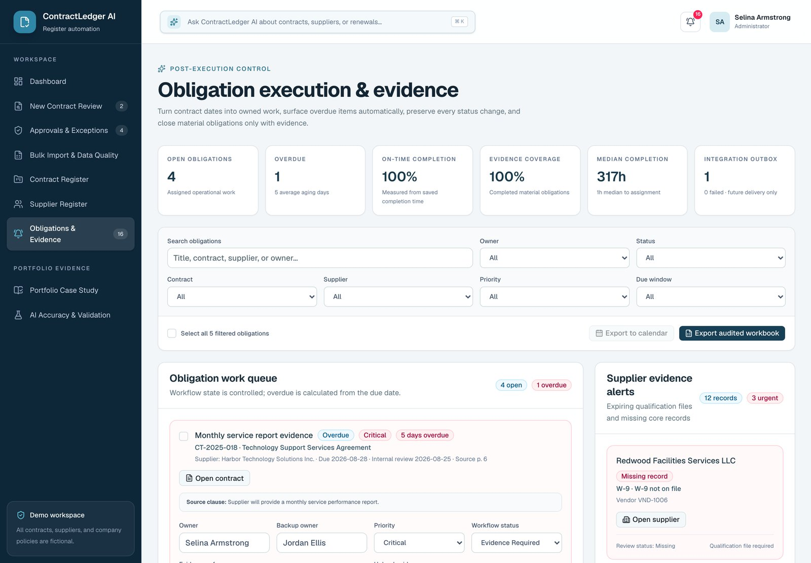
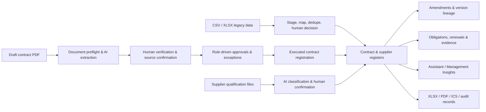

# ContractLedger AI

> An AI-assisted contract-operations workbench that turns unstructured agreements and supplier documents into verified, source-traceable, auditable operational records.

**[▶ Open the live demo](https://contractledger.selinaq.com/)** · [Case study](PORTFOLIO_CASE_STUDY.md) · [Interview one-pager](docs/INTERVIEW_ONE_PAGER.md) · [中文文档](README.zh-CN.md)



**Version:** `v1.0.0` (portfolio baseline) · **Status:** roadmap complete; core lifecycle, demo data, automated tests and release evidence all committed.

Every organisation, person, agreement, policy and qualification record in this project is **fictional**. Nothing here is legal advice.

---

## What this is

Contract and supplier teams inherit disconnected PDFs, spreadsheets, inbox decisions and hand-maintained calendars. The real operational risk is not slow data entry — it is that an unsupported value, a missed amendment, an unresolved exception or an undocumented obligation can end up looking official with no defensible source and no accountable reviewer.

ContractLedger AI addresses that specific problem. It is deliberately **narrower than a full CLM**: no negotiation, no e-signature, no enterprise identity lifecycle. Its value is in showing the controls behind reliable contract administration rather than presenting AI output as an autonomous legal decision.

The central design rule: **AI proposes, deterministic rules decide, and a human confirms anything material.**

| AI is responsible for                                   | Deterministic code is responsible for   |
| ------------------------------------------------------- | --------------------------------------- |
| Extracting and summarising document language            | Approval triggers and exception routing |
| Proposing structured field values with a page and quote | Lifecycle arithmetic across amendments  |
| Classifying supplier qualification documents            | Overdue status, supplier risk factors   |
| Answering natural-language questions over saved records | Permission checks and evaluation gates  |

## Screenshots

| Contract operations dashboard                   | AI accuracy & validation                                                      |
| ----------------------------------------------- | ----------------------------------------------------------------------------- |
|  |  |

| Contract register                                               | Obligations & evidence                                                    |
| --------------------------------------------------------------- | ------------------------------------------------------------------------- |
|  |  |

## Core capabilities

### 1. AI contract review with human verification

- Upload a draft or executed PDF; DeepSeek extracts parties, value, dates, payment terms, governing law and renewal mechanics.
- A versioned fictional playbook flags clause deviations and review findings.
- Every field retains the **model value, the human-verified value, confidence, source page, source quote, reviewer and review time**.
- A critical field without direct source support requires a written override reason.
- Page-level PDF preflight blocks corrupted, encrypted, image-only or structurally incomplete files _before_ any model call.

### 2. Approvals and exception control

- Rules generate approval requirements from value, governing law, auto-renewal, insurance status and supplier risk.
- Approve, reject, request revision, grant an exception, or escalate.
- Executed registration is blocked server-side until every mandatory approval is complete.
- Rules are snapshotted, so later rule changes never rewrite historical decisions.

### 3. Contract and amendment lifecycle

- Drafts stay in intake. A proposed value never contributes to the official contract total or supplier master data.
- Executed contracts are written transactionally to the contract register, supplier register and key-date schedule.
- Supports amendment, change order, extension, renewal, termination, price adjustment and SOW replacement.
- Original value, amendment delta, current value, version lineage and clause changes are all preserved; open obligations move with the amendment.

### 4. Supplier qualification and explainable risk

- Manages W-9, insurance certificates, business and professional licences, good-standing records, security assessments and exclusion screening.
- Supplier risk uses a deterministic, factor-level score: every component shows its rule, points, explanation and evidence.
- No opaque AI risk score, and no silent overwrite of human-maintained master-data risk ratings.

### 5. Obligations and evidence

- Obligations carry an owner, backup owner, priority and internal review date.
- Status flows `upcoming → in_progress → evidence_required → completed`. `overdue` is computed from the due date and cannot be hidden manually.
- Completion requires a note plus a file, an existing document, or a bounded external reference.
- Assignment, status, evidence, escalation and date-change events are all retained; obligations export to `.ics`.

### 6. Migration, insights and exports

- CSV/XLSX import through an isolated staging area with automatic mapping, normalisation, duplicate detection and per-row accept/skip decisions.
- Batches support audit, a correction report, and dependency-aware rollback that is blocked when later records depend on imported data.
- AI Assistant answers factual questions; Management Insights covers portfolio-level trends, concentration and recommended actions.
- Exports: contract, supplier, approval, obligation and data-quality `.xlsx` workbooks, a source-traceable contract Review Package PDF, and obligation calendars.

### 7. AI quality governance

- 15 fictional evaluation documents spanning drafts, executed contracts, supplier files, amendments, ambiguous input and negative cases.
- Records field accuracy, critical-field accuracy, source coverage, unsupported-value rate, processing success and duration, versioned by model, prompt, extraction schema, fixture and dataset.
- A complete run can be approved as the baseline; promotion is blocked when critical-field accuracy falls more than 2 percentage points below it.
- The demo ships a **seeded demonstration report** so the validation page has evidence without an API key. It is labelled in the UI as replayed fixture data, not a model measurement, and can never become an approved baseline.

### 8. Timed workflow evidence

- A stopwatch records repeated manual and AI-assisted runs of the same fictional scenario.
- The panel reports the median and sample size per mode, and **refuses to state a percentage reduction until both modes have at least three runs**.
- This is the measurement path from "implemented these controls" to a defensible time-saving claim.

### 9. Deep-linkable views

Each workspace view has a stable URL (`/?view=ai-validation`, `/?view=contracts`, …). The initial view is resolved on the server, so a shared link renders directly without a flash of the dashboard, and the browser back and forward buttons move between views. An unrecognised slug falls back to the dashboard.

### 10. Bilingual assistant

The AI Assistant answers in the language of the question. Ask in English and it replies in English; ask in Chinese and it replies in Chinese, including Chinese contract vocabulary such as 有效 and 生效 mapped to the correct record status. Monetary values are always reported in USD regardless of language.

## Business flow



## Quick start

### Prerequisites

- Node.js `22.13.0` or newer
- npm (the lockfile is committed)
- A DeepSeek API key — **not** required to browse the seeded demo, only to run AI analysis, the Assistant, Insights or a live evaluation

### Install and run

```bash
git clone git@github.com:SelinaArmstrong/contractledger-ai.git
cd contractledger-ai
npm install
cp .env.example .env.local
npm run dev
```

Open <http://localhost:3000>. Local development provides project-scoped D1 and R2 bindings through the Cloudflare Vite plugin — there is no separate database to install or start.

On macOS you can also double-click `Start ContractLedger AI.command` to launch the interview demo environment. Keep the terminal window open and press `Control-C` when finished.

### Browse the seeded demo

On localhost the app signs you in as a local administrator and seeds a complete fictional workspace: 7 executed contracts, 8 suppliers, 3 intakes, 5 obligations, 5 approval records and a seeded validation report. All of it is browsable with no API key configured.

### Walk a full contract through the system

1. **New Contract Review** → **Use demo PDF**.
2. **Analyze with DeepSeek**, then confirm each field against its confidence, source page and source quote.
3. Save the draft. It becomes an intake only — no contract total, no supplier master record.
4. **Approvals & Exceptions** → complete the Finance, Legal, Contract Owner or Compliance approvals with reasons.
5. **Contract Register** → **Register executed contract**, then analyse and verify the signed version.
6. Review the draft-to-executed comparison on the dashboard, plus approval history and the Review Package.
7. Add an amendment and confirm the value, term, payment, renewal and notice changes.
8. **Obligations & Evidence** → assign, advance status, and close with evidence.

The full ten-minute demo path and recovery steps are in [DEMO_RUNBOOK.md](DEMO_RUNBOOK.md).

## Architecture

| Layer         | Technology                                                           | Responsibility                                                                                |
| ------------- | -------------------------------------------------------------------- | --------------------------------------------------------------------------------------------- |
| Interface     | React 19, Vinext, Next.js App Router, Tailwind CSS 4, shadcn/Base UI | Single-page workbench, tables, dialogs, charts                                                |
| Server routes | `app/api/**/route.ts` (22 routes)                                    | Identity, authorization, validation, orchestration                                            |
| Domain logic  | `lib/*.ts`                                                           | Approvals, amendments, obligations, imports, AI governance, risk, insights, exports, security |
| Data access   | Drizzle ORM, Cloudflare D1 (SQLite)                                  | Registers, events, evaluations, audit, rate limits, migrations                                |
| File storage  | Cloudflare R2                                                        | Uploaded contracts, qualification files, completion evidence                                  |
| AI            | DeepSeek API, Zod strict structured output                           | Extraction, Assistant, Insights, evaluation runs                                              |
| Exports       | ExcelJS, custom PDF/ICS generation                                   | Workbooks, review packages, calendars                                                         |
| Runtime       | Vite 8, Cloudflare Workers, OpenAI Sites                             | Workers-compatible local environment, D1/R2 bindings, hosting                                 |
| Quality       | Vitest, Oxlint, TypeScript, DoD / Phase gates                        | Unit tests, static analysis, evidence gates                                                   |

Request path:

```text
React workbench
  └─ Next/Vinext API routes  (wrapped by lib/server/route-handler.ts)
       ├─ identity & role authorization / same-origin write protection / D1 rate limiting
       ├─ file signature, size, text and PDF page preflight
       ├─ domain rules & transactional orchestration
       ├─ DeepSeek (AI requests only)
       ├─ D1: structured records, events, audit
       └─ R2: source documents & completion evidence
```

Every authenticated route goes through a single `withApiRoute` wrapper that owns the permission check, database readiness and error mapping, so no route re-implements that prologue.

### Data domains

- **Contracts** — `contract_intakes`, `contracts`, `amendments`, `documents`, `review_findings`
- **Approvals** — `approval_rules`, `approval_requests`, `approval_steps`, `approval_decision_history`
- **Obligations** — `key_dates`, `obligation_events`
- **Suppliers** — `suppliers` and linked qualification documents
- **AI governance** — `ai_analysis_runs`, `ai_field_reviews`, `ai_evaluation_*`, `management_insight_runs`
- **Evidence** — `workflow_timings`
- **Migration** — `import_batches`, `import_rows`
- **Platform** — `audit_logs`, `integration_outbox`, `api_rate_limits`, `schema_migrations`

## Environment variables

All variables are server-side. Never add a `NEXT_PUBLIC_` prefix, and never commit real credentials.

| Variable                     | Required                 | Purpose                                                                     |
| ---------------------------- | ------------------------ | --------------------------------------------------------------------------- |
| `DEEPSEEK_API_KEY`           | For AI features          | Contract/supplier analysis, Assistant, Insights, evaluations                |
| `SITE_URL`                   | No                       | Canonical URL for social preview metadata (default `http://localhost:3000`) |
| `DEMO_GUEST_ACCESS`          | No                       | `true` lets signed-out visitors browse the hosted demo read-only            |
| `DEMO_ADMIN_USER_IDS`        | No                       | Comma-separated Sites user IDs allowed to reset hosted demo data            |
| `WORKSPACE_ROLE_ASSIGNMENTS` | For hosted role control  | JSON mapping Sites user IDs or emails to workspace roles                    |
| `DEMO_AUTH_USERNAME`         | For temporary demo login | Single-user demo account on a public/custom domain                          |
| `DEMO_AUTH_PASSWORD`         | For temporary demo login | Use a strong password                                                       |
| `DEMO_AUTH_DISPLAY_NAME`     | No                       | Display name for the demo user                                              |
| `DEMO_AUTH_SESSION_SECRET`   | For temporary demo login | Random session-signing secret, at least 32 characters                       |

Role mapping example:

```bash
WORKSPACE_ROLE_ASSIGNMENTS='{"user_123":"contract_administrator","legal@example.com":"legal_reviewer"}'
```

### Roles and permissions

Seven roles map to thirteen named permissions enforced on the server:

`requester` · `contract_administrator` · `legal_reviewer` · `procurement_compliance_reviewer` · `approver` · `read_only_auditor` · `administrator`

Unmapped hosted users default to `read_only_auditor`. Localhost and the temporary demo account keep administrator rights so the self-contained demo runs end to end. A contract administrator can verify operational data but **cannot approve their own exceptions**.

### Choosing a sign-in method

`/signin-with-chatgpt` is served by the OpenAI Sites proxy, not by this
application, so it only resolves on a Sites-hosted origin. A custom domain that
bypasses that proxy returns 404 for it. Set `CHATGPT_SIGN_IN_ENABLED=false`
there and give the deployment a method that works:

| Deployment                         | Recommended settings                                          |
| ---------------------------------- | ------------------------------------------------------------- |
| Sites-hosted origin                | Defaults are fine                                             |
| Custom domain, public portfolio    | `CHATGPT_SIGN_IN_ENABLED=false` + `DEMO_GUEST_ACCESS=true`    |
| Custom domain, signed-in workspace | `CHATGPT_SIGN_IN_ENABLED=false` + the `DEMO_AUTH_*` variables |

With no method enabled the sign-in page says so plainly instead of offering a
button that cannot complete.

### Read-only public demo

Setting `DEMO_GUEST_ACCESS=true` lets a signed-out visitor browse every register, approval, obligation and validation record with the `read_only_auditor` role. Uploads, decisions, imports, AI calls and workspace reset are all refused server-side. This is how the hosted demo stays open to reviewers without handing out credentials.

## Commands

| Command                  | Description                                                      |
| ------------------------ | ---------------------------------------------------------------- |
| `npm run dev`            | Start the local development environment                          |
| `npm run build`          | Produce the Cloudflare Workers production build                  |
| `npm run start`          | Serve the built `dist/server` output with Wrangler               |
| `npm test`               | Run the Vitest suite                                             |
| `npm run lint`           | Run Oxlint                                                       |
| `npm run typecheck`      | Run TypeScript                                                   |
| `npm run format`         | Format with Oxfmt                                                |
| `npm run db:generate`    | Generate a Drizzle migration from `db/schema.ts`                 |
| `npm run check:phase`    | Validate phase execution order and evidence                      |
| `npm run check:dod`      | Validate the Definition of Done manifests                        |
| `npm run check:baseline` | Deterministic release-baseline check against a running local app |
| `npm run quality`        | phase → DoD → tests → lint → typecheck → build                   |

Run before committing:

```bash
npm run quality
```

## Project structure

```text
.
├── app/
│   ├── api/                        # 22 server routes
│   ├── layout.tsx                  # global metadata
│   └── page.tsx                    # auth boundary and app entry
├── components/
│   ├── contract-ledger-app.tsx     # workbench shell and state
│   ├── views/                      # one module per workspace view
│   ├── dialogs/                    # review, amendment, approval, onboarding dialogs
│   ├── workspace/                  # shared primitives, formatters, tables, panels
│   └── ui/                         # vendored shadcn/Base UI components
├── db/
│   ├── schema.ts                   # Drizzle model
│   ├── bootstrap.ts                # versioned migrations and fictional seed data
│   └── index.ts
├── drizzle/                        # versioned SQL migrations
├── lib/                            # domain rules, validation, security, AI, exports
│   └── server/route-handler.ts     # the shared API route wrapper
├── public/demo-documents/          # 15 fictional demo & evaluation files
├── scripts/                        # release gates, baseline checks, fixture generators
└── docs/
    ├── screenshots/
    ├── definition-of-done/
    ├── execution-loop/
    └── releases/
```

## Security and data handling

- The DeepSeek key is read server-side only; raw file content and model output are never exposed as client environment variables.
- Uploads are treated as untrusted: extension, MIME type, file signature, size, UTF-8 text and PDF structure are all validated.
- PDF preflight records page count, checked pages, character counts, blank/sparse pages and rotation. Risky documents are blocked or explicitly marked for manual review.
- Hosted API access requires a Sites identity, a valid temporary demo session, or — when enabled — the read-only guest role. State-changing requests are same-origin checked.
- AI endpoints are rate limited per user and persisted in D1. Demo login allows at most 5 attempts in 15 minutes.
- Temporary demo sessions use signed, HttpOnly, SameSite cookies that expire after 12 hours.
- Material state changes are written to immutable event or audit logs. Exports are authorized server-side and leave a record.

## Quality and release baseline

| Item                               | Current baseline     |
| ---------------------------------- | -------------------- |
| Schema version                     | 21                   |
| Automated tests                    | 23 files / 140 tests |
| Fictional evaluation documents     | 15                   |
| Contracts after reset              | 7                    |
| Suppliers after reset              | 8                    |
| Intakes after reset                | 3                    |
| Obligations after reset            | 5                    |
| Approval records after reset       | 5                    |
| Current contract total after reset | USD 4,055,000        |

Two fail-closed repository gates:

- `docs/definition-of-done/` — every significant feature must account for business rules, permissions, tests, accessibility, documentation, metrics and limitations.
- `docs/execution-loop/` — every significant phase must proceed define → fixture → model → business logic → API → interface → test → measure → demonstrate → document.

These gates validate manifest structure, evidence paths, execution order and bounded metrics. They **do not** substitute for human code review, judgement about evidence quality, or real production validation.

## Known boundaries

- This is a contract-operations portfolio application. It does not cover negotiation, e-signature, enterprise identity lifecycle, or the full legal workflow.
- The playbook, companies, people, addresses, signatures, amounts and outcomes are entirely fictional. Rule prompts are not legal advice.
- Image-only files are marked OCR-ready / manual-review. No OCR service is configured or claimed.
- `integration_outbox` retains pending events only. No external email, Slack, webhook or calendar provider is connected.
- The permission policy is scoped to a single workspace. This is not a multi-tenant identity system.
- Each register snapshot in the workspace payload is capped at 500 rows; past that a register needs server-side paging and filtering rather than a larger response. The UI states when a list is truncated.
- Duplicate detection, AI accuracy and efficiency metrics apply to controlled fictional samples only. They do not represent real enterprise scale or production results.
- The tests are deterministic unit and validator tests over domain logic and the route wrapper. There is no end-to-end browser suite.

## Documentation

- [Portfolio case study](PORTFOLIO_CASE_STUDY.md) — problem, product boundary, design decisions, evidence and honest disclosures
- [Interview one-pager](docs/INTERVIEW_ONE_PAGER.md) — the 300-word version
- [Resume evidence ledger](RESUME_EVIDENCE.md) — which claims the evidence supports, and which it does not
- [Demo runbook](DEMO_RUNBOOK.md) — ten-minute demo path, talking points, recovery
- [Product roadmap](ROADMAP.md) — phase order, release scope, acceptance criteria
- [v1.0 release notes](docs/releases/v1.0.0.md) · [smoke test](docs/releases/V1_SMOKE_TEST.md) · [release evidence](docs/releases/v1.0-release-evidence.json)
- [Definition of Done](docs/definition-of-done/README.md) · [Phase execution gate](docs/execution-loop/README.md)

## Contributing

Before adding a significant feature:

1. Create a phase manifest from `docs/execution-loop/phase-template.json`.
2. Create a feature evidence manifest from `docs/definition-of-done/feature-template.json`.
3. Add fictional fixtures and the data model first, then domain logic, API and interface.
4. Attach in-repository evidence for every applicable criterion; `not_applicable` must state a specific reason.
5. Update the README, roadmap, demo path, limitations and bounded metrics.
6. Run `npm run quality`, and `npm run check:baseline` against a running local app when relevant.

## License

[MIT](LICENSE) © 2026 Selina Armstrong. The fictional demo documents in `public/demo-documents/` are part of this repository and carry the same licence.

## About

Built by **Selina Armstrong** as a portfolio project for contract administration, contract operations, legal operations, CLM analyst, procurement operations and vendor governance roles.

- LinkedIn: [linkedin.com/in/selinaarmstrong](https://www.linkedin.com/in/selinaarmstrong/)
- Live demo: [contractledger.selinaq.com](https://contractledger.selinaq.com/)

If you are evaluating this for a role, the [interview one-pager](docs/INTERVIEW_ONE_PAGER.md) is the fastest read, and the [resume evidence ledger](RESUME_EVIDENCE.md) states exactly which claims the project can and cannot support.
