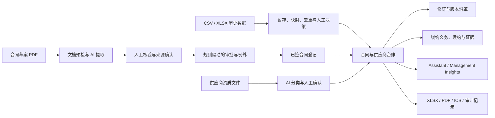

# ContractLedger AI

> 面向合同运营与供应商治理的 AI 辅助工作台：把非结构化合同和资质文件转化为经过人工核验、可追溯、可审批、可审计的业务记录。

**[▶ 打开在线 Demo](https://contractledger.selinaq.com/)** · [作品集案例](PORTFOLIO_CASE_STUDY.md) · [面试速览](docs/INTERVIEW_ONE_PAGER.md) · [English](README.md)


**当前版本：** `v1.0.0`（Portfolio-ready baseline，2026-09-02）

**项目状态：** 当前路线图已完成，核心业务闭环、演示数据、自动化测试和发布证据均已落库。

ContractLedger AI 聚焦合同签署前后的运营管理：合同条款提取、人工核验、例外审批、已签合同登记、修订版本、供应商资质、履约义务、管理洞察和审计导出。它解决的是“合同与供应商台账依赖人工录入、审批依据分散、履约证据难以追踪”的问题。

本项目是一个完整的作品集级合同运营系统，不是通用型 CLM（合同全生命周期管理）平台，也不是法律意见或自动法律决策工具。

> **企业部署说明：** 当前版本使用 DeepSeek 作为 AI 参考实现，但核心业务数据、权限、审批、审计和人工核验流程不绑定特定模型供应商。企业可根据数据驻留、合规、采购和安全策略，将服务端模型调用替换为其他商业 AI 服务或私有化部署模型。该替换需要调整服务端调用与凭据配置，并通过既有结构化输出校验和评估基线完成安全及质量回归，而不是未经验证地直接切换。

## 目录

- [核心能力](#核心能力)
- [业务流程](#业务流程)
- [快速开始](#快速开始)
- [使用方法](#使用方法)
- [技术架构](#技术架构)
- [环境变量](#环境变量)
- [常用命令](#常用命令)
- [项目结构](#项目结构)
- [数据与安全](#数据与安全)
- [质量与发布基线](#质量与发布基线)
- [部署](#部署)
- [已知边界](#已知边界)
- [相关文档](#相关文档)

## 界面预览

| 合同运营仪表盘                                  | AI 准确率与验证                                                |
| ----------------------------------------------- | -------------------------------------------------------------- |
|  |  |

| 合同台账                                                        | 履约义务与证据                                               |
| --------------------------------------------------------------- | ------------------------------------------------------------ |
|  |  |

## 核心能力

### 1. AI 合同审查与人工核验

- 上传草案或已签 PDF，通过 DeepSeek 提取合同主体、金额、日期、付款条款、适用法律、续约方式等字段。
- 使用版本化的虚构公司 playbook 识别条款偏差和审查事项。
- 每个字段保存 AI 原始值、人工确认值、置信度、来源页码、来源引文、审核人和审核时间。
- 对缺少来源证据的关键字段强制要求审核人填写覆盖理由。
- 在模型调用前执行 PDF 页级预检，阻止损坏、加密、结构不完整或无法读取的文件。

### 2. 审批与例外控制

- 根据金额、适用法律、自动续约、保险状态和供应商风险等规则自动生成审批要求。
- 支持批准、拒绝、要求修订、例外批准和升级处理。
- 已签合同登记前，服务端会再次检查所有强制审批；未完成的审批无法绕过。
- 审批规则以快照形式保存，后续规则变化不会改写历史决策。

### 3. 合同与修订版本管理

- 草案仅进入 intake 流程，不计入正式合同金额和供应商主数据。
- 已签合同经核验和审批后，事务性写入合同台账、供应商台账及关键日期。
- 支持 amendment、change order、extension、renewal、termination、price adjustment 和 SOW replacement。
- 保留原始金额、修订增量、当前金额、版本沿革及条款变化，并同步更新开放中的履约日期。
- 自动生成草案与已签版本的动态差异对比。

### 4. 供应商资质与风险

- 管理 W-9、保险证明、营业执照、专业许可、良好存续证明、安全评估和排除筛查等文件。
- AI 提议文件类型、供应商名称、签发方、编号、有效期和资质摘要，再由人工确认。
- 供应商风险采用确定性、因子级可解释评分；每个分项都展示规则、分值、说明和业务证据。
- 风险画像不会使用不可解释的 AI 风险分数，也不会静默覆盖人工维护的主数据风险等级。

### 5. 履约义务与证据闭环

- 为合同义务设置负责人、备份负责人、优先级和内部复核日期。
- 状态流为 `upcoming → in_progress → evidence_required → completed`；`overdue` 根据到期日实时计算，不能手动隐藏。
- 完成义务必须附带说明和文件、现有文档或受限的外部证据引用。
- 保存分配、状态、证据、升级和日期变更事件，并支持选择性导出 `.ics` 日历。

### 6. 迁移、洞察与导出

- 通过独立暂存区导入 CSV/XLSX，自动映射常见字段、规范化数据、识别重复项并逐行接受或跳过。
- 导入批次支持审计、纠错报告和有约束的精确回滚。
- AI Assistant 用于自然语言事实查询；Management Insights 用于组合级趋势、集中度和建议动作。
- 导出合同、供应商、审批、履约和数据质量 `.xlsx` 工作簿，以及来源可追溯的合同 Review Package PDF。
- 版本化 integration outbox 为未来通知或 webhook 投递保存事件，但当前不发送外部消息。

### 7. AI 质量治理

- 内置 15 份虚构评估文档，覆盖草案、已签合同、供应商文件、修订、模糊输入和负例。
- 记录字段准确率、关键字段准确率、来源覆盖率、不受支持值比例、处理成功率和耗时。
- 保存模型、提示词、提取 schema、fixture 和数据集版本。
- 可批准完整评估作为基线；关键字段准确率相对基线下降超过 2 个百分点时阻止晋级。

### 8. 计时工作流证据

- 内置秒表，对同一虚构场景重复记录"纯人工"与"AI 辅助"两种模式的耗时。
- 面板按模式展示中位数和样本量；**在两种模式各自达到 3 次之前，拒绝给出任何百分比降幅**。
- 这是从"实现了这些控制项"走向可辩护的效率结论的唯一测量路径。

### 9. 可深链接的视图

每个工作区视图都有稳定 URL（`/?view=ai-validation`、`/?view=contracts` 等）。初始视图在服务端解析，因此分享出去的链接会直接渲染目标页面，不会先闪一下 Dashboard；浏览器前进/后退按钮也在视图间正常切换。无法识别的 slug 回退到 Dashboard。

### 10. 双语 AI 助手

AI Assistant 按提问语言作答：中文提问返回中文，英文提问返回英文，并能把"有效""生效"等中文合同用语映射到正确的记录状态。无论使用哪种语言，金额一律按美元报告。

## 业务流程



系统刻意把 AI 放在“提出建议”的位置，把人工核验、权限检查、业务规则和审计记录放在最终决策链上。

## 快速开始

### 前置条件

- Node.js `22.13.0` 或更高版本
- npm（仓库已提交 `package-lock.json`）
- DeepSeek API Key（浏览种子数据不需要；执行 AI 分析、Assistant、Insights 或评估需要）

### 安装与启动

```bash
git clone git@github.com:SelinaArmstrong/contractledger-ai.git
cd contractledger-ai
npm install
cp .env.example .env.local
```

在 `.env.local` 中至少配置：

```bash
DEEPSEEK_API_KEY=your_deepseek_api_key
SITE_URL=http://localhost:3000
```

启动开发环境：

```bash
npm run dev
```

访问 [http://localhost:3000](http://localhost:3000)。本地开发环境会通过 Cloudflare Vite 插件提供项目级 D1 和 R2 绑定；无需另行安装 PostgreSQL 或启动外部数据库。

macOS 也可以双击 `Start ContractLedger AI.command` 启动面试演示环境。演示期间请保持终端窗口开启，结束时按 `Control-C`。

## 使用方法

### 浏览现有演示数据

应用在 localhost 下自动使用本地管理员身份，并初始化一组完全虚构的合同、供应商、审批、义务和导入数据。即使尚未配置 DeepSeek Key，也可以浏览 Dashboard、各类 Register、审批历史、版本记录和作品集证据。

### 跑通一条完整合同流程

1. 进入 **New Contract Review**，选择 **Use demo PDF**。
2. 点击 **Analyze with DeepSeek**，逐项确认字段、置信度、来源页码和来源引文。
3. 保存草案。此时它只会成为 intake，不会进入正式合同金额或供应商主数据。
4. 进入 **Approvals & Exceptions**，完成 Finance、Legal、Contract Owner 或 Compliance 要求的审批，并填写必要理由。
5. 进入 **Contract Register**，选择 **Register executed contract**，分析并核验已签版本。
6. 登记完成后，在 Dashboard 查看草案到已签版本的差异，在合同详情中查看审批历史和 Review Package。
7. 对已登记合同添加 amendment，确认金额、期限、付款条款、续约和通知期变化。
8. 进入 **Obligations & Evidence**，分配任务、推进状态并用证据完成关闭。

### 供应商与数据质量流程

1. 在 **Bulk Import & Data Quality** 下载合同或供应商模板，上传 CSV/XLSX 并检查自动映射。
2. 审查规范化值、错误、警告和重复候选项，对每行选择接受或跳过，再提交批次。
3. 在 **Supplier Register** 打开供应商，查看可解释风险因子和资质状态。
4. 上传示例保险证明或其他资质文件，执行 AI 分析后人工确认元数据。
5. 使用 **AI Assistant** 查询事实，或从合同/供应商台账打开 **Management Insights** 查看组合级分析。

完整的十分钟演示路径和故障恢复方式见 [DEMO_RUNBOOK.md](DEMO_RUNBOOK.md)。

## 技术架构

| 层级       | 主要技术                                                                 | 职责                                                        |
| ---------- | ------------------------------------------------------------------------ | ----------------------------------------------------------- |
| 界面       | React 19、Vinext、Next.js App Router API、Tailwind CSS 4、shadcn/Base UI | 单页工作台、表格、对话框、图表和响应式交互                  |
| 服务端接口 | `app/api/**/route.ts`                                                    | 身份解析、授权、输入验证、业务编排和响应输出                |
| 领域逻辑   | `lib/*.ts`                                                               | 审批、修订、义务、导入、AI 治理、风险、洞察、导出和安全策略 |
| 数据访问   | Drizzle ORM、Cloudflare D1（SQLite）                                     | 台账、事件、评估、审计、限流和 schema 迁移                  |
| 文件存储   | Cloudflare R2                                                            | 上传合同、供应商资质和履约证据                              |
| AI         | DeepSeek API（可替换的参考实现）、Zod 严格结构化输出                     | 合同/文档提取、Assistant、Management Insights 和评估运行    |
| 导出       | ExcelJS、自有 PDF/ICS 生成逻辑                                           | 工作簿、运营审查包和日历文件                                |
| 运行与托管 | Vite 8、Cloudflare Workers、OpenAI Sites                                 | 本地 Workers 兼容环境、D1/R2 注入和托管                     |
| 质量       | Vitest、Oxlint、TypeScript、Definition of Done / Phase gates             | 领域逻辑与路由包装器的确定性单元测试、静态检查和证据门禁    |

核心请求路径如下：

```text
React 工作台
  └─ Next/Vinext API Routes
       ├─ 身份与角色授权 / 同源写保护 / D1 限流
       ├─ 文件签名、大小、文本与 PDF 页面预检
       ├─ 领域规则与事务编排
       ├─ DeepSeek（仅 AI 请求）
       ├─ D1：结构化业务数据、事件与审计
       └─ R2：原始文档与完成证据
```

### 主要数据域

- 合同：`contract_intakes`、`contracts`、`amendments`、`documents`、`review_findings`
- 审批：`approval_rules`、`approval_requests`、`approval_steps`、`approval_decision_history`
- 履约：`key_dates`、`obligation_events`
- 供应商：`suppliers` 与供应商关联文档
- AI 治理：`ai_analysis_runs`、`ai_field_reviews`、`ai_evaluation_*`、`management_insight_runs`
- 数据迁移：`import_batches`、`import_rows`
- 平台控制：`audit_logs`、`integration_outbox`、`api_rate_limits`、`schema_migrations`

## 环境变量

全部为服务端变量，不要加 `NEXT_PUBLIC_` 前缀，也不要提交真实凭据。

| 变量                            | 必填               | 用途                                             |
| ------------------------------- | ------------------ | ------------------------------------------------ |
| `DEEPSEEK_API_KEY`              | AI 功能必填        | 合同/供应商分析、Assistant、Insights、评估       |
| `SITE_URL`                      | 否                 | Open Graph 等站点元数据的规范 URL                |
| `DEMO_GUEST_ACCESS`             | 否                 | 设为 `true` 时未登录访客可只读浏览               |
| `WORKSPACE_SESSION_SECRET`      | **任何登录都必填** | 至少 32 位的随机会话签名密钥                     |
| `DEMO_AUTH_USERNAME`            | 需要审阅账号时     | 审阅账号用户名 —— 无默认值                       |
| `DEMO_AUTH_PASSWORD`            | 需要审阅账号时     | 审阅账号密码 —— 无默认值                         |
| `DEMO_AUTH_DISPLAY_NAME`        | 否                 | 审阅账号显示名                                   |
| `DEMO_AUTH_ROLE`                | 否                 | 审阅账号角色（默认 `demo_operator`）             |
| `ADMIN_AUTH_USERNAME`           | 需要管理员登录时   | 可选管理员账号 —— 托管环境下重置工作区的唯一途径 |
| `ADMIN_AUTH_PASSWORD`           | 需要管理员登录时   | 请使用强密码                                     |
| `AI_DAILY_UNIT_BUDGET`          | 否                 | 全局每日模型调用上限（默认 `250`）               |
| `AI_VISITOR_HOURLY_UNIT_BUDGET` | 否                 | 单访客每小时上限（默认 `40`）                    |

## 访问控制与成本控制

### 登录方式

只有一种登录方式：用户名 + 密码，校验通过后签发签名的 HttpOnly、12 小时有效的会话 Cookie。

**仓库内不含任何凭据。** 账号和会话签名密钥全部来自托管平台的密钥存储，因此克隆这个仓库不会获得任何访问权限；未配置的部署是「没有登录入口」，而不是「有一个可猜的入口」。`WORKSPACE_SESSION_SECRET` 是任何账号生效的前提 —— 没有它，一个已知的签名密钥就能让任何人不凭密码伪造出有效会话。

需要走完整写入 / AI 流程的招阅方，由你单独发放凭据；其他人走下面的只读访客视图，无需账号，也无法消耗 AI 额度。

用 `openssl rand -base64 48` 生成签名密钥，并把这些值配置在托管平台的运行时变量里 —— 不要写进仓库。

localhost 请求按本地维护者处理，所以 `npm run dev` 无需登录。已登录会话优先于该快捷方式 —— 这样你可以在本地用 demo 账号登录，看到的就是招聘方看到的画面。

### 角色与权限

八个角色映射到十三项服务端强制权限：

`requester` · `contract_administrator` · `legal_reviewer` · `procurement_compliance_reviewer` · `approver` · `read_only_auditor` · `demo_operator` · `administrator`

`contract_administrator` 可以核验业务数据，但**不能审批自己提出的例外**。审阅账号所持的 `demo_operator` 可以走完整的合同运营流程（含审批），但**刻意不能重置工作区** —— 凭据会发给不止一位审阅者，一次重置会抹掉另一位正在进行到一半的记录。托管环境重置需要可选的 `ADMIN_AUTH_*` 账号。

把 `DEMO_AUTH_ROLE` 设为策略中的任意角色，即可从该角色视角演示产品，例如 `legal_reviewer` 或 `read_only_auditor`。

### 只读公开 Demo

设置 `DEMO_GUEST_ACCESS=true` 后，未登录访客以 `read_only_auditor` 角色浏览全部台账、审批、履约与验证记录；上传、决策、导入、AI 调用和重置在服务端一律拒绝。

### 如何防止 AI 接口被滥用

共享凭据意味着多位审阅者以同一个身份触达模型接口，而仅靠按用户限流并不能约束账单：他们共用同一个令牌桶；而一个每十分钟就重新填满的桶，在一天的尺度上根本没有上限。

每次模型调用前有三层防护：

| 层级             | 作用范围                       | 目的                     |
| ---------------- | ------------------------------ | ------------------------ |
| 按主体的突发限流 | 按账号 + 按路由，10 分钟窗口   | 阻止对单个操作的快速重复 |
| 按访客的小时预算 | 哈希后的客户端地址，1 小时窗口 | 防止一个人抽干共享额度   |
| 全局每日预算     | 整个部署，按 UTC 日            | 真正的成本天花板         |

调用按加权单位计价，权重对应实际的模型往返次数：一次分析 1 单位，Management Insights 2 单位，15 份文档的验证运行 15 单位 —— 因此最贵的操作无法靠反复点击把当天额度耗光。

设计上**失败即拒绝**：计数器读写失败时拒绝调用而不是放行，因为猜错的代价是一张无上限的账单。预算预留使用原子 upsert，并发请求不会同时占用最后一个单位；被后一层拒绝的预留会被退还而不是白白烧掉。

额度耗尽只会禁用**模型调用**。全部已保存记录、种子验证报告、审计历史和台账导出仍可完整浏览，剩余额度会显示在 AI 准确率页面。

## 常用命令

| 命令                     | 说明                                            |
| ------------------------ | ----------------------------------------------- |
| `npm run dev`            | 启动本地开发环境                                |
| `npm run build`          | 生成 Cloudflare Workers 兼容的生产构建          |
| `npm run start`          | 使用 Wrangler 启动已生成的 `dist/server` 构建   |
| `npm test`               | 运行 Vitest 测试套件                            |
| `npm run lint`           | 运行 Oxlint                                     |
| `npm run typecheck`      | 运行 TypeScript 类型检查                        |
| `npm run format`         | 使用 Oxfmt 格式化代码                           |
| `npm run db:generate`    | 根据 `db/schema.ts` 生成 Drizzle migration      |
| `npm run check:phase`    | 验证阶段执行顺序和证据                          |
| `npm run check:dod`      | 验证 Definition of Done 清单和证据              |
| `npm run check:baseline` | 对正在运行的本地应用执行确定性发布基线检查      |
| `npm run quality`        | 依次执行 phase、DoD、测试、lint、类型检查和构建 |

推荐在提交前执行：

```bash
npm run quality
```

如需验证 v1.0 演示数据与接口基线，请保持本地应用运行，并在另一个终端执行：

```bash
npm run check:baseline
```

## 项目结构

```text
.
├── app/
│   ├── api/                     # 服务端路由与业务编排
│   ├── chatgpt-auth.ts          # Sites 托管身份读取
│   ├── layout.tsx               # 全局元数据与布局
│   └── page.tsx                 # 登录边界与应用入口
├── components/
│   ├── contract-ledger-app.tsx  # 主工作台与业务视图
│   ├── management-chart-card.tsx
│   └── ui/                      # 可复用 UI 组件
├── db/
│   ├── schema.ts                # Drizzle 数据模型
│   ├── bootstrap.ts             # 版本化迁移与虚构种子数据
│   └── index.ts                 # D1 数据库入口
├── drizzle/                     # 版本化 SQL migrations
├── lib/                         # 领域规则、验证、安全、AI 与导出逻辑
├── public/demo-documents/       # 15 份虚构演示/评估文件
├── scripts/                     # 发布门禁、基线验证和 fixture 生成脚本
├── docs/
│   ├── definition-of-done/      # 功能完成定义及可执行证据
│   ├── execution-loop/          # 标准阶段执行清单
│   └── releases/                # v1.0 发布说明与 smoke test
├── .openai/hosting.json         # Sites 项目及 D1/R2 逻辑绑定
├── ROADMAP.md
├── DEMO_RUNBOOK.md
└── PORTFOLIO_CASE_STUDY.md
```

主要 API 按职责分组：

- 分析：`/api/analyze`、`/api/analyze-supplier-document`、`/api/amendments/analyze`
- 业务记录：`/api/workspace`、`/api/intakes`、`/api/suppliers`、`/api/supplier-documents`、`/api/amendments`
- 控制流程：`/api/approvals`、`/api/obligations`、`/api/imports`
- AI 与治理：`/api/assistant`、`/api/management-insights`、`/api/evaluations`
- 查询与导出：`/api/record-details`、`/api/document`、`/api/review-package`、`/api/exports/authorize`
- 身份与演示：`/api/auth/*`、`/api/workspace/reset`

## 数据与安全

- DeepSeek Key 仅在服务端读取；原始文件内容和模型输出不会作为前端环境变量暴露。
- DeepSeek 是当前默认 AI 供应商，而非业务层的强制依赖；替换其他 AI 产品或私有化模型时，必须保持服务端凭据隔离、最小化数据传输、结构化输出校验、人工复核、审计记录和评估回归等控制。
- 上传内容按不可信输入处理，校验扩展名、MIME、文件签名、大小、UTF-8 文本和 PDF 结构。
- PDF 预检记录页数、检查页数、字符数、空白/稀疏页及旋转状态；有风险的文档被阻止或明确标记为需要人工复核。
- 托管 API 需要 Sites 身份或有效的临时演示会话；状态变更请求执行同源检查。
- 七角色、十三项服务端权限覆盖文档提交、字段核验、供应商维护、审批、修订、义务关闭、导入、AI 治理、导出和重置等动作。
- AI 接口采用按用户、D1 持久化的限流；演示登录在 15 分钟内最多尝试 5 次。
- 临时演示会话使用签名的 HttpOnly、SameSite Cookie，12 小时后过期。
- 关键状态变化写入不可变事件或审计日志；导出操作也会进行服务端授权并留下记录。

## 质量与发布基线

`v1.0.0` 发布证据记录了以下可重复验证的状态：

| 项目               |                   当前基线 |
| ------------------ | -------------------------: |
| Schema 版本        |                         21 |
| 自动化测试         | 25 个测试文件 / 182 项测试 |
| 虚构评估文件       |                         15 |
| 重置后合同         |                          7 |
| 重置后供应商       |                          8 |
| 重置后 intake      |                          3 |
| 重置后履约义务     |                          5 |
| 重置后审批记录     |                          5 |
| 重置后当前合同总额 |              USD 4,055,000 |

仓库使用两类“失败即阻断”的工程治理：

- `docs/definition-of-done/`：每个重大功能必须覆盖业务规则、权限、测试、可访问性、文档、指标和限制等完成标准。
- `docs/execution-loop/`：每个重大阶段必须按 define → fixture → model → business logic → API → interface → test → measure → demonstrate → document 的顺序推进。

门禁能验证清单结构、证据路径、执行顺序和有界指标，但不能替代人工代码审查、证据质量判断或真实生产验证。

## 部署

项目面向 OpenAI Sites / Cloudflare Workers 运行，逻辑资源绑定位于 `.openai/hosting.json`：

```json
{
  "d1": "DB",
  "r2": "FILES"
}
```

生产构建：

```bash
npm run build
```

本地检查生产构建：

```bash
npm run start
```

托管环境变量应通过 Sites 的运行时配置管理，不要写入仓库。仓库没有定义通用的公开发布脚本；正式发布由已关联的 Sites 项目完成，并由平台注入真实 D1、R2 和身份信息。

## 已知边界

- 这是合同运营作品集应用，不覆盖合同谈判、电子签名、企业级身份生命周期或全部法律工作流。
- 内置 playbook、企业、人员、地址、签名、金额和业务结果全部是虚构内容；规则提示不是法律意见。
- 图片文件只会被标记为 OCR-ready / 需要人工复核；当前没有配置或宣称 OCR 服务。
- `integration_outbox` 只保留待投递事件，目前没有外部邮件、Slack、webhook 或日历同步提供商。
- 权限策略以单一工作区为边界，不是完整的多租户身份管理系统。
- 重复项识别、AI 准确率和效率指标仅针对受控虚构样本，不代表真实企业规模或生产结果。
- workspace payload 中每个台账快照上限为 500 行；超出后需要服务端分页与过滤，而不是更大的响应体。界面会明确提示列表已被截断。
- 测试为覆盖领域逻辑与路由包装器的确定性单元测试和校验器测试，尚无端到端浏览器测试套件。
- 本地基线验证 D1/R2 支持的可重置演示环境；托管健康状态仍需按实际部署单独验证。

## 参与开发

新增重大功能前：

1. 从 `docs/execution-loop/phase-template.json` 创建阶段清单，定义用户故事、规则、非目标、验收标准和前置缺陷门禁。
2. 从 `docs/definition-of-done/feature-template.json` 创建功能证据清单。
3. 先补充虚构 fixture 和数据模型，再实现领域逻辑、API 与界面。
4. 为所有适用标准附上仓库内证据；`not_applicable` 必须说明具体理由。
5. 更新 README、Roadmap、演示路径、限制和有界指标。
6. 运行 `npm run quality`，需要时再运行本地 `npm run check:baseline`。

## 许可证

[MIT](LICENSE) © 2026 Selina Armstrong。`public/demo-documents/` 中的虚构演示文件属于本仓库，适用同一许可证。

## 关于作者

由 **Selina Armstrong** 开发，作为合同管理、合同运营、法务运营、CLM 分析、采购运营与供应商治理岗位的作品集项目。

- LinkedIn：[linkedin.com/in/selinaarmstrong](https://www.linkedin.com/in/selinaarmstrong/)
- 在线 Demo：[contractledger.selinaq.com](https://contractledger.selinaq.com/)

## 相关文档

- [面试速览](docs/INTERVIEW_ONE_PAGER.md)：300 字版本
- [产品路线图](ROADMAP.md)：阶段顺序、发布范围、验收标准和当前完成状态
- [作品集案例](PORTFOLIO_CASE_STUDY.md)：问题、产品边界、设计决策、证据和诚实声明
- [演示手册](DEMO_RUNBOOK.md)：十分钟演示流程、讲解重点和恢复方案
- [履历证据账本](RESUME_EVIDENCE.md)：可安全使用的项目成果表述与证据边界
- [v1.0 发布说明](docs/releases/v1.0.0.md)：发布内容与已知限制
- [v1.0 Smoke Test](docs/releases/V1_SMOKE_TEST.md)：自动化基线和界面核验清单
- [发布证据清单](docs/releases/v1.0-release-evidence.json)：版本、fixture、指标和重置库存
- [Definition of Done](docs/definition-of-done/README.md)：功能完成门禁规则
- [Phase Execution Gate](docs/execution-loop/README.md)：标准阶段执行和证据规则
