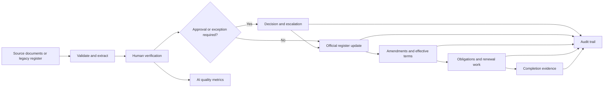

# ContractLedger AI Product Roadmap

**Roadmap version:** 2026-09-01  
**Primary objective:** turn ContractLedger AI into a practical, auditable contract-operations portfolio product that creates defensible resume and interview evidence.  
**Primary target roles:** Contract Administrator, Contract Operations Analyst, Legal Operations Analyst, CLM Analyst, Procurement Operations, and Vendor Governance.

## 1. Product direction

ContractLedger AI should remain a focused contract-administration system rather than expand into a generic, full-scale CLM platform. Its differentiator is the combination of:

- real contract and supplier operations knowledge;
- human-in-the-loop AI review;
- source traceability and auditability;
- lifecycle controls from draft intake through post-execution administration; and
- measurable workflow and data-quality outcomes.

The product story should be:

> ContractLedger AI converts unstructured contract and supplier documents into verified operational records, routes exceptions to the right reviewers, maintains effective terms across amendments, and turns contractual dates into accountable work—with every AI-assisted decision tied to its source and reviewer.

### North-star workflow

## 2. Product principles

Every new feature must follow these rules:

1. **Verified data, not autonomous legal decisions.** AI proposes; a human confirms material fields and decisions.
2. **Source before confidence.** A confidence score is not proof. Critical values must have a source page and quote or an explicit reviewer override.
3. **Draft and official records stay separate.** Proposed terms never silently enter the executed-contract register.
4. **Effective terms are reproducible.** The system must explain how the current value, expiration date, and obligations were derived.
5. **Actions are auditable.** Material changes retain actor, timestamp, before/after values, reason, and related source.
6. **Fictional and privacy-safe demonstrations.** Portfolio fixtures must not contain real employer or supplier confidential information.
7. **Metrics must be earned.** Resume claims come from saved evaluation or workflow measurements, not estimates.
8. **Focused scope.** Do not add e-signature, billing, negotiation, or general document-management features unless they directly strengthen the contract-operations story.

## 3. Current baseline

The current application already demonstrates:

- draft contract analysis against a versioned fictional playbook;
- executed-contract registration into official contract and supplier records;
- human correction of AI fields with source page, quote, confidence, reviewer, and timestamp;
- supplier qualification document analysis and onboarding;
- contract and supplier registers, alerts, renewal decisions, audit history, and Excel export;
- assigned obligation execution with calculated overdue state, completion evidence, event history, workflow metrics, and calendar export;
- dynamic draft-to-executed comparison;
- natural-language factual retrieval and separate management insights;
- a versioned 15-document AI validation suite with case- and field-level evidence;
- authenticated hosted access, server-side rate limiting, D1 persistence, and R2 document storage; and
- automated tests, linting, type checking, and production build checks.

### Current release state

Amendment & Version Lifecycle (v0.2), Approval & Exception Workflow (v0.3), Bulk Import & Data Quality (v0.4), Obligation Execution & Evidence (v0.5), AI Quality & Governance (v0.6), Document Quality, OCR Readiness & Permissions (v0.7), and Review Package, Supplier Risk & Integrations (v0.8) now form a connected lifecycle: legacy data can enter through an isolated, reversible staging process; verified draft values create durable approval controls; incomplete mandatory controls block signature readiness and executed registration; approved decisions remain visible after execution; later amendments preserve the resulting official history and update open lifecycle obligations; post-execution dates become assigned, evidence-backed work with an immutable closeout record; model quality is measured against versioned fictional ground truth with human-correction and regression evidence; unreadable source files or unauthorized actors cannot silently enter or alter the workflow; and verified records can leave the system as a source-aware review package while visible supplier factors and durable outbox events support operational follow-up.

## 4. Release sequence

| Release | Product milestone                             | Status    | Relative effort | Resume value |
| ------- | --------------------------------------------- | --------- | --------------- | ------------ |
| v0.2    | Amendment & Version Lifecycle                 | Complete  | Large           | Very high    |
| v0.3    | Approval & Exception Workflow                 | Complete  | Large           | Very high    |
| v0.4    | Bulk Import & Data Quality                    | Complete  | Large           | Very high    |
| v0.5    | Obligation Execution & Evidence               | Complete  | Medium          | High         |
| v0.6    | AI Quality & Governance                       | Complete  | Large           | Very high    |
| v0.7    | Document Quality, OCR Readiness & Permissions | Complete  | Medium/Large    | Medium-high  |
| v0.8    | Review Package, Supplier Risk & Integrations  | Complete  | Medium          | Medium-high  |
| v1.0    | Portfolio-ready Contract Operations System    | Target    | —               | Maximum      |

The recommended cadence is one coherent release at a time. For part-time development, plan approximately one to two focused weeks for a medium phase and two to three for a large phase, but release only when the exit criteria are satisfied.

## 5. Phase 0 — Stabilize the baseline

**Purpose:** create a reliable foundation so future metrics and demonstrations are reproducible.

### Steps

1. Confirm that demo reset always produces the same contracts, suppliers, alerts, analyses, and documents.
2. Record the current database schema version and fixture inventory.
3. Add a short smoke-test checklist for the primary workflow:
   - review draft;
   - verify extracted fields;
   - register executed agreement;
   - inspect supplier and obligations;
   - open audit trail;
   - export workbook.
4. Preserve a known-good benchmark result for the existing three evaluation cases.
5. Document current limitations, especially fictional playbook scope, single-workspace assumptions, and lack of legal advice.
6. Run the full quality gate and save the result in release notes.

### Exit criteria

- Demo reset is deterministic.
- No seeded file is missing or linked to the wrong record.
- All existing automated checks pass.
- The core demo can be completed without manually repairing state.
- A clean baseline release/tag can be created after the current uncommitted work is resolved.

## 6. Phase 1 — Amendment & Version Lifecycle (v0.2)

**Business problem:** signed contracts continue to change through amendments, change orders, extensions, renewals, price adjustments, SOW replacements, and terminations. A register that stores only the original agreement becomes unreliable.

**Outcome:** the system preserves the original agreement and every verified amendment while calculating a defensible current effective state.

### User story

> As a contract administrator, I can upload a signed amendment, verify the extracted changes, and update the official agreement without losing the original terms or the change history.

### Implementation steps

1. **Complete schema and migration invariants.**
   - One unique version number per contract.
   - Exactly one current lifecycle version after each applied amendment.
   - Original, amendment, and current values remain arithmetically consistent.
   - Existing records migrate without inventing unknown terms.
2. **Harden amendment matching.**
   - Require the selected parent contract.
   - Compare the referenced contract number and supplier with the selected record.
   - Block or require explicit override for a mismatch.
3. **Finish the human-verification workspace.**
   - Show extracted delta, resulting value, old/new expiration, payment terms, renewal type, notice period, and scope summary.
   - Require confirmation of every material changed field.
   - Preserve the model value separately from the verified value.
4. **Apply the amendment transactionally.**
   - Save document and AI review.
   - Create amendment/version record.
   - Supersede the prior current version.
   - Update official contract values and effective terms.
   - Recalculate notice deadline and affected key dates.
   - Write a single coherent audit event with before/after values.
   - Roll back all database changes when any critical step fails.
5. **Complete lifecycle presentation.**
   - Display V1 original agreement and subsequent versions in order.
   - Clearly distinguish historical terms from current terms.
   - Open the source document and AI audit trail for each version.
6. **Complete exports and assistant behavior.**
   - Include version, amendment count, cumulative change, and current effective terms in exports.
   - Ensure factual queries use current effective terms unless the user explicitly asks for history.
7. **Expand tests.**
   - Positive and negative value adjustments.
   - Explicit resulting value versus calculated delta.
   - Date extension and notice-deadline recalculation.
   - Termination and no-value-change amendment.
   - Contract-number mismatch.
   - Duplicate amendment/version submission.
   - Transaction rollback on failure.

### Acceptance criteria

- A USD 475,000 agreement plus a verified USD 75,000 amendment displays USD 550,000 as the current value.
- The original USD 475,000 remains visible and unchanged.
- Superseded and current versions cannot both be marked current.
- A changed expiration or notice term automatically updates dependent monitoring dates.
- Every applied amendment has a source document, verified field history, actor, timestamp, and before/after audit record.
- Resetting the demo restores a consistent amendment example.

### Evidence to capture

- Amendment processing time.
- Number of amendment fields accepted versus corrected.
- Percentage of changed fields with source support.
- Zero inconsistent current-value/version states across test scenarios.

## 7. Phase 2 — Approval & Exception Workflow (v0.3)

**Status:** Complete — 2026-09-01

**Business problem:** detecting a playbook exception is not enough. Real contract operations must assign it, obtain a decision, record the reason, and prevent premature progression.

**Outcome:** high-risk or policy-triggered issues become controlled, time-bound decisions.

### Minimum scope

- Versioned approval rules.
- Approval requests and steps.
- Finding-level exception decisions.
- Assigned reviewer, due date, comment, and status.
- Escalation and approval-aging queue.
- Execution gate when required approvals are incomplete.

### Initial rule examples

| Trigger                                      | Required decision owner | Expected control             |
| -------------------------------------------- | ----------------------- | ---------------------------- |
| Proposed or executed value above USD 500,000 | Finance/CFO role        | Financial approval           |
| Non-California governing law                 | Legal reviewer          | Legal exception decision     |
| Automatic renewal                            | Contract owner          | Renewal-control confirmation |
| Missing or insufficient insurance            | Procurement/Compliance  | Supplier-risk decision       |
| High-risk supplier classification            | Compliance reviewer     | Enhanced due diligence       |

### Implementation steps

1. Define the approval state machine: `pending → in_review → approved / declined / revision_requested / cancelled`.
2. Add `approval_rules`, `approval_requests`, `approval_steps`, and decision history, or the smallest equivalent normalized model.
3. Generate required approvals deterministically from verified values and playbook rules.
4. Build an approval queue with owner, reason, age, deadline, and related source.
5. Allow `approve`, `decline`, `request revision`, `approve exception`, and `escalate` actions.
6. Require a reason for exception approval and high-risk override.
7. Prevent executed registration while mandatory approvals remain open or declined.
8. Preserve immutable decision history in the audit trail.
9. Add reminders and aging metrics without sending external email in the first release.

### Acceptance criteria

- The same verified contract values always generate the same approval requirements.
- A high-risk exception cannot disappear because a user edits the page or reruns AI.
- Registration is blocked until all mandatory approval steps are satisfied.
- Every decision records actor, role, timestamp, reason, rule version, and source finding.
- Approval history remains visible after the contract is executed.

### Evidence to capture

- Approval turnaround time.
- Number and age of open exceptions.
- Exception approval rate.
- Number of blocked premature registrations in test scenarios.

### Delivered evidence

- Five versioned fictional rules cover financial threshold, governing law, automatic renewal, insurance status, and high-risk supplier classification.
- Demo reset produces four open approval requests for the Westline draft and one completed high-risk-supplier approval retained on an executed Pacific contract.
- The completed seeded request records a reproducible 26-hour turnaround; the queue calculates current open, overdue, blocked-intake, turnaround, and exception-rate metrics directly from saved data.
- Ten deterministic approval tests cover rule generation, compliant non-generation, inactive rule versions, state transitions, immutable terminal decisions, reason requirements, request-state derivation, due dates, and the execution gate.
- Server routes enforce mandatory approvals before both `approved_for_signature` and executed registration, while the approval action batch stores step state, request state, intake summary, immutable history, finding exception status, and audit evidence together.

## 8. Phase 3 — Bulk Import & Data Quality (v0.4)

**Status:** Complete — 2026-09-01

**Business problem:** organizations already have contract registers and supplier masters in spreadsheets. A useful system must accept legacy data safely instead of requiring manual re-entry.

**Outcome:** users can map, validate, deduplicate, preview, and commit CSV/XLSX records with an auditable import report.

### Minimum scope

- CSV and XLSX input.
- Contract register and supplier master templates.
- Column mapping preview.
- Date, currency, status, and supplier-name normalization.
- Duplicate and possible-match detection.
- Row-level errors and downloadable correction report.
- Dry run before commit.
- Import batch audit history and batch rollback.

### Implementation steps

1. Publish sample import templates with required and optional columns.
2. Introduce `import_batches` and `import_rows` so preview results are separated from official records.
3. Validate file signature, type, size, row count, headers, and formula-injection risk.
4. Add a mapping step for common aliases such as `Vendor Name → Supplier Legal Name`.
5. Normalize dates, values, states, statuses, contract numbers, and supplier names.
6. Detect exact duplicates and show possible matches without silently merging them.
7. Produce a preview summary: ready, warning, duplicate, and invalid rows.
8. Commit only accepted rows in a transaction and retain the mapping/version used.
9. Export rejected rows with actionable error messages.

### Acceptance criteria

- Preview never changes official data.
- Invalid rows do not prevent valid rows from being reviewed.
- Duplicate handling always requires an explicit user decision.
- Commit and rollback are repeatable and auditable.
- Imported data produces the same alerts and register behavior as manually created data.

### Evidence to capture

- Rows processed per import.
- Import acceptance and rejection rate.
- Duplicate detection precision on the fictional test set.
- Median time to migrate a sample legacy register.
- Number of normalization issues detected before commit.

### Delivered evidence

- CSV and XLSX supplier-master and contract-register templates are generated from the same field catalog used by mapping and validation; mapping version `2026.1` recognizes common legacy aliases without changing official data.
- `import_batches` and `import_rows` retain file metadata and hash, original and normalized row values, mapping, issues, duplicate candidates, explicit decisions, created record IDs, actors, and preview/commit/rollback timestamps.
- File controls enforce CSV/XLSX signature and type, UTF-8 CSV content, 5 MB and 150-row limits, nonempty unique headers, and spreadsheet-formula injection detection. Correction exports neutralize formula-leading cells.
- Deterministic normalization covers ISO and U.S. dates, USD cents, contract and supplier statuses, renewal types, U.S. state names/codes, contract numbers, and legal-name normalization. Exact duplicates cannot be accepted; possible matches require an explicit accept or skip.
- A two-row runtime migration proved that dry run left the official register at 7 contracts and 6 key dates, unresolved rows blocked commit, one accepted valid contract produced 8 contracts and 8 key dates, and audited rollback restored exactly 7 contracts and 6 key dates. A repeated rollback remained idempotent.
- The same runtime exercise produced an actionable rejected-row CSV with the formula cell safely escaped, and a generated XLSX supplier template was uploaded and parsed into a ready row.
- Ten deterministic bulk-import tests cover alias mapping, date and currency normalization, existing-record and within-file duplicates, unknown suppliers, formula injection, summary metrics, notice-deadline calculation, and correction-export safety. The repository suite now contains 51 passing tests.
- Batch timestamps and row counts support processed-row, acceptance/rejection, normalization-issue, and migration-duration metrics as additional completed batches accumulate; no unmeasured time-savings claim is made.
- The import workspace now aggregates saved dry runs into a portfolio evidence panel showing rows assessed, finalized-row acceptance, duplicate candidates, normalization issues, and median preview-to-commit duration with its completed-batch sample size. Preview-only decisions are excluded from outcome rates so unfinished work cannot inflate the evidence.

## 9. Phase 4 — Obligation Execution & Evidence (v0.5)

**Status:** Complete — 2026-09-01

**Business problem:** an alert only says that work is due. It does not prove ownership, completion, or supporting evidence.

**Outcome:** contract dates become assigned tasks with status, escalation, completion evidence, and closeout history.

### Minimum scope

- Owner, priority, due date, internal review date, and status.
- Status flow: `upcoming → in_progress → evidence_required → completed` plus calculated `overdue`.
- Completion note, completed by, and completed at.
- Linked source clause/page.
- Linked evidence document or document reference.
- Status history and escalation.
- Calendar export after the core workflow is stable.

### Implementation steps

1. Extend the existing key-date model before creating a separate task subsystem.
2. Define status transitions and which transitions require notes or evidence.
3. Add ownership, priority, and internal review fields to the work queue.
4. Allow supporting evidence to be linked from existing R2 documents or uploaded safely.
5. Record status-change events instead of overwriting all history.
6. Add overdue calculations and backup-owner escalation.
7. Add filters for owner, contract, supplier, due window, status, and priority.
8. Add `.ics` export for selected obligations; defer outbound email until explicitly scoped.

### Acceptance criteria

- Completing a material obligation records who completed it, when, and with what evidence.
- Overdue status is calculated consistently and cannot be manually hidden.
- Source clause and completion evidence are available from the same detail view.
- Amendment-driven date changes update open obligations without erasing prior history.

### Evidence to capture

- On-time completion rate.
- Overdue obligation count and aging.
- Percentage of completed material obligations with evidence.
- Median time from alert to assignment and completion.

### Delivered evidence

- The existing `key_dates` model now owns durable status, primary and backup owners, priority, materiality, assignment/completion timestamps, completion actor and note, source document/clause/page, evidence document or reference, and escalation state; `obligation_events` retains every material transition separately.
- Server logic enforces `upcoming → in_progress → evidence_required → completed`, rejects skipped or terminal transitions, requires an owner after work begins, and requires both a completion note and evidence before closeout. `overdue` is calculated from the due date rather than stored as an editable status.
- Evidence can reuse a document already related to the contract or supplier, or upload a validated PDF/PNG/JPEG of at most 8 MB to a dedicated R2 prefix. Failed database writes attempt object cleanup so an evidence upload is not silently orphaned.
- The work queue combines owner, contract, supplier, status, priority, due-window, and keyword filters; supports backup-owner escalation for overdue work; exposes source and evidence in one card; shows immutable event history; and exports 1–100 selected obligations as standards-compatible all-day `.ics` events.
- Amendment application updates the still-open expiration and notice obligations in place and writes `due_date_changed` events with old/new dates and amendment evidence. When a term is removed, the prior obligation is closed with the amendment as its evidence instead of erasing history.
- A deterministic fictional scenario includes five obligations: one completed on time with an evidence reference, one overdue in `evidence_required`, and three upcoming items. The dashboard derives on-time completion, overdue count/aging, evidence coverage, and median assignment/completion time from saved records without presenting the one-item completed sample as a generalized productivity claim.
- Six obligation-workflow tests cover valid and invalid transitions, calculated overdue state, completion-evidence gates, reproducible metrics, and escaped calendar output. The repository suite contains 57 passing tests; lint, TypeScript, production build, workspace API, obligation-detail API, and multi-event calendar export also pass.

## 10. Phase 5 — AI Quality & Governance (v0.6)

**Business problem:** a portfolio project should not claim that AI works without measuring accuracy, traceability, correction behavior, and regression risk.

**Outcome:** ContractLedger AI provides field-level, version-aware evidence for model quality and human oversight.

### Dataset plan

Expand from three cases to 15–30 fictional documents across:

- draft and executed services agreements;
- supply agreements;
- amendments, extensions, and terminations;
- W-9s;
- certificates of insurance;
- business licenses and good-standing records;
- documents with missing fields, ambiguous wording, tables, and low text quality; and
- negative cases such as wrong supplier, wrong contract reference, or unsupported values.

Keep a manifest for each case containing document type, difficulty, expected fields, critical fields, ground truth, and fixture version.

### Metrics

| Metric                  | Definition                                                            |
| ----------------------- | --------------------------------------------------------------------- |
| Field accuracy          | Correct evaluated fields ÷ all evaluated fields                       |
| Critical-field accuracy | Correct value/date/party/notice fields ÷ critical fields              |
| Source coverage         | Fields with valid source page and supporting quote ÷ evaluated fields |
| Human correction rate   | Corrected AI fields ÷ reviewed AI fields                              |
| Unsupported-value rate  | Values without adequate source support ÷ evaluated values             |
| Processing success rate | Documents completing analysis ÷ attempted documents                   |
| Median processing time  | Median elapsed time from upload to review-ready result                |
| Regression delta        | Current metric minus approved baseline for the same benchmark         |

### Implementation steps

1. Separate immutable ground truth from live operational data.
2. Add field-level evaluation results rather than storing only run summaries.
3. Track model, prompt version, extraction version, fixture version, duration, and failure reason.
4. Reuse `ai_field_reviews` to calculate real correction rates from operational demo workflows.
5. Add dashboards by document type, field, model, and prompt version.
6. Add regression gates before adopting a new model or prompt.
7. Require reviewer override reason when a critical saved field lacks source support.
8. Export a validation report suitable for a case study or interview appendix.
9. Label targets separately from achieved results.

### Initial target gates

These are development targets, not resume claims:

- 100% of saved critical fields have source support or an explicit reviewer override.
- 0 unknown or client-supplied benchmark case IDs accepted by the server.
- No new prompt/model is promoted when critical-field accuracy regresses beyond the agreed threshold.
- Evaluation files never enter operational registers.
- Every published metric identifies dataset size and version.

### Evidence to capture

- Achieved accuracy and source coverage with sample size.
- Correction rate by field.
- Regression results between prompt/model versions.
- Processing time by document type.
- Examples of failures discovered and controls added as a result.

### Completion evidence

- Dataset `contractledger-fictional-2026.09` contains 15 server-controlled fictional fixtures across draft and executed agreements, supplier qualification documents, an amendment, ambiguous records, and a negative unsupported-input case. The immutable code manifest records document type, difficulty, fixture version, expected fields, critical fields, and ground truth; no API accepts a caller-supplied case ID.
- D1 stores versioned run summaries plus normalized case- and field-level results. Each run records model, prompt, extraction, fixture and dataset versions, duration, failure reason, processing success, field accuracy, critical-field accuracy, source coverage, unsupported-value rate, confidence, baseline and regression status.
- A complete run may be explicitly approved as the comparison baseline. Later runs are marked `eligible` or `blocked`; critical-field accuracy that drops by more than two percentage points cannot be promoted.
- The dashboard shows achieved metrics separately from development targets, breaks quality down by document type, and groups operational correction evidence by field, workflow stage, model, and prompt version.
- Critical saved fields without a page and supporting quote require a specific reviewer override reason, enforced by server routes and retained in `ai_field_reviews` for contract, amendment, existing-supplier, and new-supplier workflows.
- The latest validation appendix exports as CSV with run metrics, every field result, dataset/sample/version labels, baseline comparison, and operational correction counts. Evaluation files are fetched only by the evaluation route and never create operational register or R2 records.

## 11. Phase 6 — Document Quality, OCR Readiness & Permissions (v0.7)

**Status:** Complete — 2026-09-01

### 6A. Document preflight and OCR readiness

Add a pre-analysis quality report that detects:

- image-only or low-text-density pages;
- rotated pages;
- blank pages;
- password-protected or corrupted PDFs;
- unsupported file signatures;
- unexpectedly missing pages; and
- pages requiring OCR or manual review.

Start with detection and clear failure states. Add an OCR provider only after the benchmark contains enough scanned documents to justify it.

**Acceptance gate:** unreadable input must never produce an apparently confident operational record without a warning and required human review.

### 6B. Role-based access and separation of duties

Introduce a minimal role policy rather than a full enterprise identity platform:

- Requester;
- Contract Administrator;
- Legal Reviewer;
- Procurement/Compliance Reviewer;
- Approver;
- Read-only Auditor; and
- Administrator.

Map permissions for viewing documents, editing verified fields, approving exceptions, applying amendments, completing obligations, exporting data, and resetting the workspace.

**Acceptance gate:** permissions are enforced by server routes, not only by hidden UI controls, and every denied write has an automated authorization test.

### Delivered evidence

- Shared preflight version `document-preflight-2026.1` inspects the text count and rotation of every PDF page before a contract, amendment, or supplier-document model call. The saved report exposes ready, human-review, and blocked states plus page-level OCR/manual-review flags.
- PDF/image/TXT extensions, declared media types, signatures, binary-text content, and UTF-8 validity are checked independently. Password-protected, corrupted, structurally incomplete, over-limit, and wholly unreadable PDFs return a clear blocked report; blank, sparse, or rotated pages append durable warnings and cannot bypass the existing all-field human-verification gate.
- Image qualification records are explicitly marked OCR-ready and manual-review required. No OCR provider is invoked or claimed; provider selection remains deferred until scanned-document benchmark evidence justifies it.
- Migration `0015_clever_paibok.sql` adds the nullable `quality_report_json` audit field to AI runs without inventing quality results for legacy records. Record-detail and intake APIs expose the retained report with the review history.
- Seven workspace roles map to thirteen explicit permissions. Local/demo actors remain administrators, configured hosted identities receive their assigned role, and every unassigned hosted identity defaults to read-only auditor.
- All material API routes now request a named permission for viewing documents, submitting documents, editing verified or supplier data, approving exceptions, applying amendments, completing obligations, importing, running AI/governance workflows, exporting, or resetting. Contract-administrator and approval permissions are deliberately separated, and approval history retains both the actor's actual role and the rule's accountable owner role.
- Authorization tests exercise a server `403` for every material write denied to an auditor and verify the contract-administrator/approver separation. Document-quality tests cover ready, blank, sparse, rotated, missing-page, image, signature/media mismatch, binary text, and a real ten-page fictional agreement. The repository suite contains 75 passing tests; lint, TypeScript, and the production build also pass.

## 12. Phase 7 — Review Package, Supplier Risk & Integrations (v0.8)

**Status:** Complete — 2026-09-01

These features should be started only after v0.7 evidence is strong.

### Review package export

Generate a concise Word or PDF review package containing:

- contract metadata;
- high-risk findings;
- current versus preferred language;
- suggested operational revision;
- accepted deviations and approval decisions;
- source pages; and
- reviewer and version history.

The package must be presented as an operational review aid, not legal advice.

### Explainable supplier risk profile

Create a rules-based profile using visible factors such as:

- W-9 and qualification status;
- insurance coverage and expiration;
- licenses and good-standing records;
- cybersecurity or exclusion screening;
- open high-risk findings;
- contract concentration; and
- overdue supplier obligations.

Do not present a model-generated risk score without factor-level explanation.

### Lightweight integrations

- Calendar export for obligations.
- Stable CSV/XLSX interchange formats.
- Webhook/outbox records for future notifications.
- Optional document-repository links.

Avoid direct email, e-signature, or third-party CLM integrations until the internal event and permission models are stable.

### Delivered evidence

- Contract details generate an authorized, audited Letter-size PDF review package from current D1 records. It includes contract metadata, medium/high findings, observed versus preferred controls, suggested operational revisions, source file/page references, accepted approval decisions, version history, and human/model review history, with an explicit operational-aid/not-legal-advice boundary.
- Review package version `review-package-2026.1` has deterministic pagination, ASCII-safe PDF text, page numbering, a stable sanitized filename, private/no-store response headers, and a retained `review_package_exported` audit event. A fictional package was rendered with Poppler and visually checked for clipping, overlap, hierarchy, and legibility.
- Supplier profile version `supplier-risk-2026.1` recalculates from eight visible factors: the human-approved classification, W-9, insurance status/expiration, qualification completeness, screening/standing evidence, open high-risk findings, active-value concentration, and overdue obligations. Every factor exposes its points, rule explanation, and underlying evidence; no model generates or hides the score.
- The Supplier Register displays the calculated level and score, filters on that calculated level rather than the legacy tier alone, and opens a factor-by-factor profile from the supplier record.
- Migration `0016_white_stardust.sql` adds a durable `integration_outbox`. Obligation updates, completion, and escalation write versioned pending events in the same D1 batch as their operational and audit records; reset seeds one reproducible event and the obligations view exposes pending/failed counts without claiming that external delivery is active.
- Eight deterministic tests cover supplier factor scoring and thresholds, review-package validity/source content/file naming, and versioned outbox construction. The repository suite contains 83 passing tests; lint, TypeScript, production build, workspace/reset API, review-package API, PDF structure, and UI visibility checks also pass.

## 13. Cross-cutting portfolio and resume track

This track runs alongside every release.

### Case study

Maintain a portfolio case study with:

1. The manual contract-operations problem.
2. Why draft, executed, and supplier records are separated.
3. Workflow and data-model decisions.
4. Human-in-the-loop and source-traceability controls.
5. Security and privacy boundaries.
6. Validation methodology and sample size.
7. Measured results.
8. Known limitations and next steps.

### Demo scenario

Build toward a ten-minute end-to-end story:

1. Import a fictional legacy register.
2. Review a draft agreement.
3. Identify payment, governing-law, or approval exceptions.
4. Record reviewer decisions.
5. Register the executed agreement.
6. Apply an amendment.
7. Show the recalculated current terms.
8. Assign and complete a renewal or compliance obligation.
9. Open the evidence and audit trail.
10. Show AI quality metrics and export the final register.

### Resume evidence ledger

After each release, record only measured and reproducible facts:

| Release | Evidence to retain                                         | Possible future resume use               |
| ------- | ---------------------------------------------------------- | ---------------------------------------- |
| v0.2    | Amendment scenarios, version consistency, source coverage  | Contract lifecycle and change control    |
| v0.3    | Approval rules, decision aging, blocked unsafe progression | Governance and cross-functional workflow |
| v0.4    | Rows migrated, issues detected, time saved                 | Data migration and register integrity    |
| v0.5    | Obligations completed with evidence, overdue trend         | Post-execution administration            |
| v0.6    | Accuracy, source coverage, correction rate, sample size    | Responsible AI and measurable automation |
| v0.7    | Preflight outcomes, blocked writes, role-policy test matrix | Document quality and separation of duties  |
| v0.8    | Review-package contents, visible risk factors, outbox events | Operational reporting and integration readiness |

Do not update resume metrics until the corresponding release and evidence have passed their exit criteria.

## 14. Definition of done for every major feature

A feature is not complete until all applicable items are satisfied:

- A clear contract-operations user story exists.
- The happy path and at least two failure paths are implemented.
- Loading, empty, validation, error, and success states are usable.
- Server-side validation enforces the same rules as the interface.
- Material writes are transactional where partial state would be unsafe.
- Actor, timestamp, source, and before/after values are auditable.
- D1 schema changes include a reviewed migration and existing-data strategy.
- R2 files are deleted or retained consistently when database writes fail.
- Deterministic business logic has unit tests.
- API authorization and invalid-input paths have tests.
- A fictional demo fixture exercises the workflow.
- Export and assistant behavior are updated when the official data model changes.
- Accessibility and keyboard behavior are checked for the new interaction.
- Test, lint, type check, and production build pass.
- README, demo script, roadmap status, and limitations are updated.
- At least one useful metric is captured without overstating results.

## 15. Standard execution loop for each phase

Use the same implementation sequence to control scope:

1. **Define:** write the user story, business rule, non-goals, and acceptance criteria.
2. **Fixture first:** create one realistic positive document and at least one failure/edge case.
3. **Model:** design the smallest schema change and migration path.
4. **Business logic:** implement deterministic calculations and state transitions outside the UI.
5. **API:** add validation, authorization, transaction boundaries, storage cleanup, and audit events.
6. **Interface:** add the smallest complete workflow with clear review and decision states.
7. **Test:** cover calculation, state transition, invalid input, authorization, rollback, and regression cases.
8. **Measure:** save the phase metrics and sample size.
9. **Demonstrate:** add the feature to the resettable fictional demo scenario.
10. **Document:** update README, case study, roadmap status, limitations, and resume evidence ledger.

Do not start the next major phase while the previous phase still has unresolved data-integrity or audit-trail defects.

## 16. Explicit non-goals

The following are outside the near-term roadmap:

- building an e-signature service;
- autonomous negotiation or autonomous legal advice;
- a full online Word editor;
- customer billing or subscription management;
- blockchain or smart-contract functionality;
- native mobile applications;
- complex multi-tenant administration;
- adding many AI models without an evaluation need;
- decorative dashboards without actionable metrics; and
- integrations that are not supported by stable internal workflows and permissions.

## 17. v1.0 portfolio-ready exit criteria

ContractLedger AI is ready to present as a mature portfolio project when:

- one fictional agreement can move through draft review, exception approval, executed registration, amendment, obligation completion, and audit review;
- a fictional legacy register can be imported through a dry-run and data-quality workflow;
- current effective contract terms can be reproduced from the original agreement and amendments;
- material obligations have accountable owners and completion evidence;
- 15–30 fictional documents have versioned ground truth and saved evaluation results;
- achieved AI metrics identify sample size, document mix, and limitations;
- role restrictions and server-side authorization protect material actions;
- the demo resets reliably and contains no confidential information;
- the full quality gate passes; and
- the case study and resume bullets use only verified project evidence.

At that point, the strongest positioning is not “built an AI website.” It is:

> Designed and validated a human-in-the-loop contract operations system that controls how contract and supplier data are extracted, verified, approved, amended, monitored, measured, and audited.
